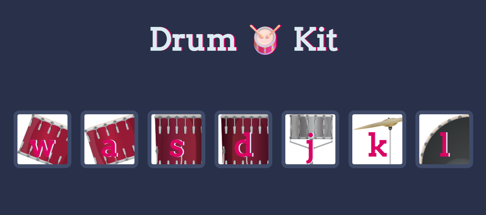

# Instrument Sound Web App 🎶

  

A musical instrument web application

## Table of Contents

- [About The Project](#about-the-project)
- [Features](#features)
- [Getting Started](#getting-started)
  - [Prerequisites](#prerequisites)
  - [Installation](#installation)
- [Usage](#usage)
- [Contributing](#contributing)
- [Contact](#contact)

## About The Project

A lightweight, browser-based app allowing users to play various musical instrument sounds by interacting with on-screen elements.



## Features

The key features and functionalities of the project.

- Feature 1: **Multiple instruments** (e.g., crash, kick, snare, tom)
- Feature 2: - **Interactive UI** – click/tap images or buttons to play sounds
- Feature 3: - **Responsive design** – works on desktops, tablets, and phones
- Feature 4: - **Plain JavaScrip**

## Getting Started

Guide for setting up your project locally.

### Prerequisites

Software, libraries, or tools that need to be installed before running your project.

- Open index.html in a browser — no server or tools needed.

### Installation

Step-by-step instructions on how to get your development environment running.

1.  Clone the repo
    ```sh
    git clone https://github.com/PrarabdhSoni/instrument-sound-app.git
    ```
2.  Navigate into the project directory
    ```sh
     cd instrument-sound-app
    ```

## Usage

- Fun and entertainment 🎉

- Basic music education or teaching tools 🎓

- Soundboard creation 🔊

- Kids’ interaction games 👧👦

## Contributing

Contributions are welcome! Fork the project, make enhancements, and send a pull request. For major changes, please open an issue first to discuss.

## Contact

Feel free to contact me 😊

- Email: prarabdhsoni1@gmail.com
- Linkedin: https://linkedin.com/in/prarabdh-soni
